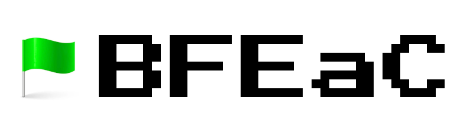

# BFEaC
BMX Flatland Etiquette as Code

BFEaC is an Open Source project to codify BMX Flatland etiquette.

## Description

BFEaC provides the yaml file, bmx_flatland_etiquette.yaml that defines the essential characteristics of proper BMX Flatland etiquette.

The yaml file can be uploaded to AI tools for an interactive BMX Flatland etiquette learning experience.
